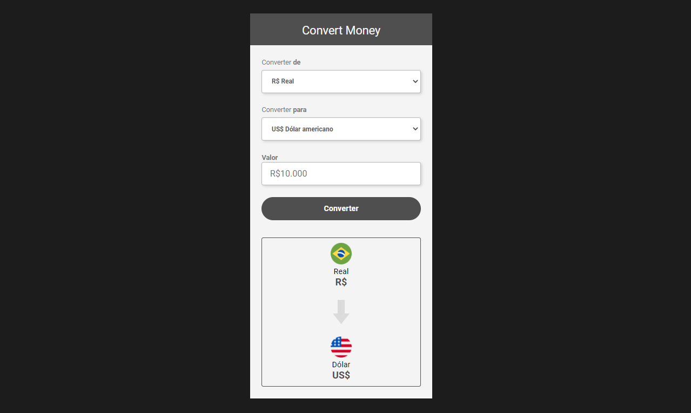

# My Money Converter
 

> Printscreen da página do conversor de dinheiro 

### Acessar projeto

  O projeto está disponível no site:
  https://mymoneyconverter.netlify.app/
  
  ### Observação

 Para este projeto foi utilizado HTML, CSS e JavaScript, onde pude consolidar meus conhecimentos e praticar a linguagem e lógica de programação, sinto que evoluí enquanto buscava soluções, e por fim conseguir finalizar a página.

## 🤝 Autor do projeto

<table>
  <tr>
    <td align="center">
      <a href="#">
       
        
          <b> Pedro Henrique</b>
        
      </a>
    </td>
  </tr>
</table>

